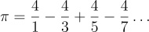
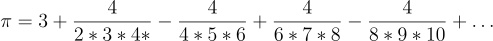

# Homework 4 - Problem 3 (Calculating pi)
This one is pretty simple, but hard to debug.
took me 1 hours-ish. YMMV! 

**[READ THIS BEFORE YOU BEGIN!!!!!!](https://github.com/RyoTakei/Matlab-Class)**
-

## Warning!!
This program has a loop that runs more than 100,000 times. Yes you heard it correctly, 
more than 100,000 times. That's right, a hundred thousand times. It took my computer 
about 5-10 minutes to run. Be careful, your computer will get hot. Just be very careful
before running it!!!!

## Breakdown
This problem is very straight forward. You're asked to find the value of pi
using infinite series. I believe this is the topic that's covered in 252 and/or 253. 

The equation is given in the instruction. 





(For those using dark mode, I'm sorry. github can't do Latex render)

This problem seems like a hard and complicated stuff, but it's really not when we break 
this down. Frankly, this problem is all about finding patters and throw it into the program.

So here are the main 4 steps we can take.

- Define the loop. 
- Construct what's inside the loop.
- Repeat for the second equation.
- Display proper output.

Really, this problem is 2 parts times 2. Before you do, read through the end because there are
some things that you probably need to know.

### Step 1. Define the loop
When I say define the loop, I mean what is the loop going to be doing, and in what condition 
should the loop end. Or continue. 

Let's first talk about what the look is going to be doing. All this loop should do is to calculate
the value of pi using infinite series. And to do that, we need a loop to add or subtract each term
to the final value until we meet the requirements (In other words, this loop will replace Sigma.)

Now should this be a while loop or a for loop? To answer that question, we first need to know the 
difference between while and for loop. If you already know, skip to the next part. For loop is generally
used when we know how many times we need to loop. For example, to go through each element in an array,
we use a for loop because we know *exactly* how many times we need to loop. Another example would be
when we did the epidemic problem. We knew *exactly* how many times we needed to loop. On the other hand
we use a while loop when we don't know how many times we need to loop but we do have some conditions 
and need to loop "until" that condition is met. A good example was labs in week 3. We didn't know 
how many times we needed to loop, but we had the condition, `totalCups < least_num_cups` so that 
loop ran "until" that condition is met. In short, for loop is when we know how many times to loop,
and while loop is a "until" loop where you have a condition to end the loop and will run until the 
condition is met. That's also why while loop can cause an infinite loop because some condition can be 
never met in your code. 

So what is the answer? Do we know how many times we need to run this loop? Or we don't? The 
easiest way to answer this question is to simply look at the instruction. 

>a)	Calculate pi using the first equation. Stop when your answer is within 1e-5 of MATLAB’s value of pi. 
> Print out your value of pi and MATLAB’s value of pi using 12 digits. 
> Also print out the number of iterations (loops) it took. 

Well, that sounds like we don't know how many times to loop, in fact, that's exaclty what we're trying to
find out to get credits for this program. So I think our only option here is a while loop. Then, do we 
have any conditions to end the loop? Again, take a look at the instruction. 

>Stop when your answer is within 1e-5 of MATLAB’s value of pi.

That's a clear sign of while loop. Now, we just need to translate English to matlab language! 
I'll show you some tricks at the end. 

### Step 2. What's inside the while loop?
I am only going to talk about first equation, and I'll let you think about second one all by yourself. 
As I said, this problem is all about finding the pattern. If you can find the pattern, you just need to 
repast the pattern over and over in the loop. 

Here's the equation again, what do you see? 


I see a couple of things
- The sign alternates. 
- Denominator is every odd number.
- Numerator is always 4.

And that's it for this equation. if you haven't taken 252 or 253(or whatever class that covers series), 
this is called alternating series because the sign alternates. Look it up if you want to know more. 

Now we know the basic, we can start planning how to code. The idea is that first loop, we will add  `4/1`,
and subtract `4/3` in second iteration, add `4/5` in third iteration etc etc. And we stop when your pi 
value is within `1e-5`. 

Let's look at patters we've found one by one and see how we can implement this in matlab.

#### Alternating signs

The instruction gave us answers already. 

>a.	Hint1: Use mod(k,2) to determine if you should be adding or subtracting each loop iteration. 
> mod(k,2) returns 0 if k is even, 1 if k is odd. 

We look into the iteration number and use that to decide if you're adding or subtracting value.

#### Denominator is every odd number.

Should be easy too. I'll make a quick table and see if you can figure it out.

Iteration | Denominator |
------------ | ---------------------
1 | 1 |
2 | 3 |
3 | 5 |
4 | 7 |
5 | 9 |
...| ...|

If you can express denominator using itetration number, that's all you need. 

#### Numerator is always 4. 
Did you know that 1 + 3 is 4? Did you also know that 2 * 2 is 4? But 1 + 2 is not 4....

Ok jk, it's just 4. Need to expalin more? 

## Tips to get started.
By now, you should have full understanding, but I want to give you some useful tips before you start.
This program requires some precision, at least `1e-5`. If you simpy type 

```math
>> pi
```
in Command Window what do you get? You'd only get `3.1416`. Matlab rounds floats(decimal, but we call 
it float. Wonder why we use `%f` for decimal? well, that's why) to 4 decimal numbers when it prints. 
But, we need more than 4... How can we do that? There's a very useful function called `vpa`. Look it up on Google and 
play around with it to understand what it does! Here's a few things you can do to try out. 

```math
>> vpa(pi, 2)

>> vpa(pi, 10)

>> vpa(pi, 100)

>> 3 - vpa(pi, 10)

>> 3 - pi
 
>> 1/3

>> 3.1415926 - pi

>> 3.1415926 - vpa(pi, 10)
```

Remember, pi has tons of decimal places after 4, but it rounds ONLY when it prints. So you don't need it 
for while loop, or anything in the code. You should be able to write while loop without it. Try out the last two
to see the difference. 
