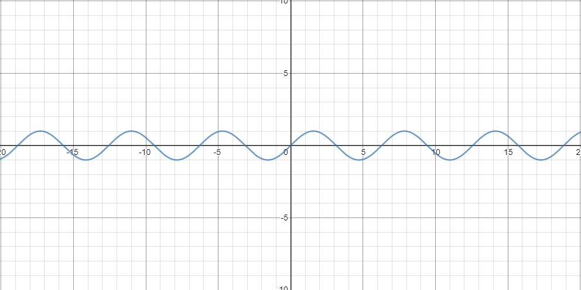
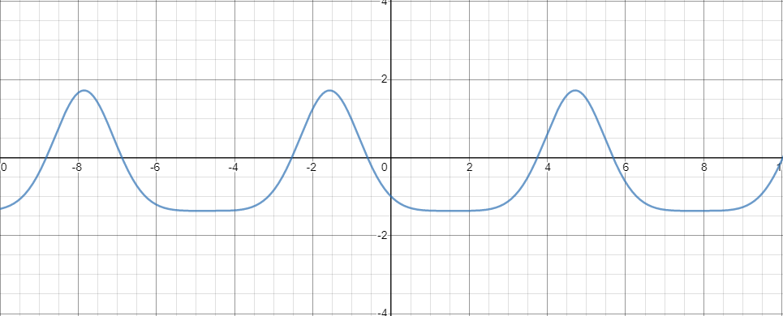

# Homework 5 - Problem 1 (Projectile)

This one was pretty tricky, took me 1 hours-ish. YMMV!

**[READ THIS BEFORE YOU BEGIN!!!!!!](https://github.com/RyoTakei/Matlab-Class)**
-

## fzero function

UPDATE: Haha I guess this was covered in zybooks... I didn't know. So you can skip it if you
already know fzero. Sorry.

This problem is super easy if you know how to use `fzero`. If you don't, keep reading this guide. 
If you already know how this works, you should have no issues completing this problem. Overall,
other than tricky `fzero` function, this problem is very easy.

I'll show you what `fzero` is and show you some examples.

[Here](https://www.mathworks.com/help/matlab/ref/fzero.html?searchHighlight=fzero&s_tid=srchtitle) 
is the official documentation of `fzero`. Feel free to take a look and try to understand by yourself
but doc is hard to read anyways... 

Now, the basic idea of `fzero` is that it finds the intersections of your function and x-axis,
or the function returns 0. In more mathmatical term, it finds the roots of a function, 
particularly non-linear function. 

Let's look at `y = sin(x)` as an example.



Because we're so used to trig functions, we already know when `sin(x)` intersects with x-axis.
Those are when x is equal to, 0, _&pi;_, 2 _&pi;_, 3 _&pi;_ etc.

(Note that in this case, trig functions have inverse functions which we can just use to find
the roots. But in a lot of times when we're dealing with none-linear functions,
inverse functions don't exit and it's better to just guess and use `fzero` as you'll see later)

But, what if we don't know? Or what if the function is so complicated? Or inverse functions don't 
exist? Here's another example



This function is `-sin(x)exp(-sin(x))-1`. None-linear, no inverse, no nothing. 
It's impossible for us to know where this function is 0 just by looking at the 
equation. Though I'm sure there's some kind of pattern here, I just don't feel
like doing calculation. 

By looking at the picture, we can see that it happens 
at around -3, -0.5, 4, 5.5, etc. This is where we can use `fzero` -- but we're 
going to assume one thing:

```matlab
f = @(x)-sin(x)*exp(-sin(x))-1;
```
exists. And I'm doing to refer this function as `f` from now. 

The syntax of fzero looks like this
```matlab
x = fzero(f, guess);
```

We're going to feed `fzero` 2 things:
- Function
- Our rough guess of where this function is 0

Function is easy. We've already done it, I set up an anouymous function like I have above.
The guess is kind of tricky but we're doing to tell this function where our zero might be at.
In our case, since we already graphed it, we know that it happens at around -3, -0.5, 4, 5.5.
If you have absolutely no idea where your roots might be, you need to come up with a strategy 
to find our guesses. More on that in Problem 2. 

Here is the output of command window:

```
>> f = @(x)-sin(x)*exp(-sin(x))-1;
>> fzero(f); % first without any guesses 
Error using fzero (line 124)
FZERO requires at least two input arguments or a structure with valid fields.
 
>> fzero(f, -3) % our first guess

ans =

   -2.5386

>> fzero(f, -0.5) % our second guess

ans =

   -0.6030

>> fzero(f, 4)

ans =

    3.7446
```
So as you see, this function is 0 when x is around -2.5386, -0.6030, 3.7446, etc. 
If you don't believe me, try `f(-2.5386)`. 

I do recommend playing around with fzero in command window and find out more.
Here's just a couple of questions for you and it should help you understand more.
- How accurate does our guess need to be? 
- Can we throw in range of values? `fzero(f, [2, 3])` work?
- What if function doesn't have roots? try `sin(x) + 3`


## Breakdown
Now, we're finally talking about the problem...

We've given two equations. x and y positions of projectile given initial velocity(`v`) and
launch angle(_&theta;_).

We're asked to find when this projectile hits the ground and how far away(in x-direction) 
did the projectile hit the ground. Think of x as distance, and y as height. 

Here's steps you can take to
- Find the `t` at which point `y = 0`. Aka projectile is on the ground.
- Use that `t` to calculate x -- how far away from launched position.


### Step 1. Finding t
I already gave you equation in "EXAMPLE_HW5P1.m" file above. 

Since y is a none-linear function, you're going to be using `fzero` to find the `t`. Remember, 
you need to provide a guess number. You can graph it, you can claculate it, you can imagine it, 
whatever method works for you. Graphing might be the easiet way for you. 

### Step 2. Find the distance

Now you have t from step 1, you just need to plug that t into your x function. And you're done.

### That's a wrap!
Yup, super simple if you understand how to use fzero. Giving your guess numbers is 
the hardest part. And don't worry if this was too easy, problem 2 gets harder ;pp

### Extra stuff (For nerds only)
If you're wondering why we need to provide our guess number... It's not because it needs it
for the calculation. Matlab can give you the roots just by the equation. Then, why do we 
need to feed our guess? Well, it's because the functions we're dealing with are none-linear. 
If we're dealing with linear functions, the function only has one root. If we're dealing with 
polynomials, especially 2nd degree, we can use `roots` functions. 

Ok so what's the differnce? We'll, none-linear functions could have 0 roots, 1, 2, 3, or just
infinite number of roots. Take `sin(x)` for example, it has infinite roots. So that's why 
we need to provide our guess number. It tells Matlab to look around our guess number and see 
if it can find any roots. I say guess, but it's more like pointing at spots where matlab needs 
to look for. Again, unique property of none-linear functions. And that, is why we hate it :))
