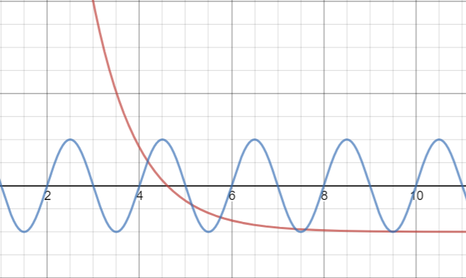
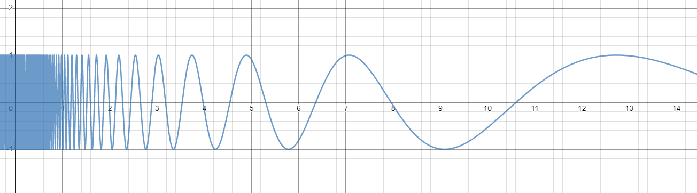

# Homework 5 - Problem 2 (Function intersections)

Ok, I figured it out. Shout out to Michael for the idea.

Tricky, took me a few hours but with this guide you should be able to finish it in a couple hours.


**[READ THIS BEFORE YOU BEGIN!!!!!!](https://github.com/RyoTakei/Matlab-Class)**
-

## Breakdown

This assignment is upgrade from Problem 1. The core of this problem is all about `fzero`.
You're given two none-linear functions. And you're asked to find the intersections of two 
functions. `F1(x) == F2(x)`. 

Two functions are given below:

```matlab
F1 = @(x)100*exp(-x)-1;
F2 = @(x)sin(pi*x);
```

Here is the graph of two functions



Notice that we're only looking at a domain of 2 to 10. As you can see, 
there are about 7 intersections. In this problem, we're asked to find those 
7 intersections. 

First, take a look at the instructions and read the hints carefully.

**In this guide, I will show you how to get full credits. The way 
that I'm going to show will work and gets you full credits but ideally this is not
the way you want to tackle this kind of problem. More on that later**

Here are the steps you can take.

- Set up equation to use `fzero`.
- We need to generate some guesses.
- We go through each guess and find roots.
- Sort and filter your answers.
- Plot those functions and intersection points on a graph.

Let's go one by one

### Step 1. Setup functions
Let's go ahead and set up functions first. Here are two functions we're given.

```matlab
F1 = @(x)100*exp(-x)-1;
F2 = @(x)sin(pi*x);
```
Finding intersections is pretty hard as is. You need to find x, so that `F1(x)` is
equal to `F2(x)`. 

Now, after reading the instructions and hints, we need to set up a function
that we can use with fzero. Aka, when `F1(x)` is equal to `F2(x)`, it returns 0.
So in sort, you can just take the difference of F1(x) and F2(x) so that intersection 
points returns 0.

[Here](https://www.desmos.com/calculator/ax1e3x4qxv) is the graph on desmos. Take a look
and see if you can make sense of those graph. Green line is the difference. 
So when green line hits the x-axis, `f` and `g` intersects. 

We will call this `rootsFunction`.

```matlab
rootsFunction = @(x)F1(x) - F2(x)
```

Now the `rootFunction` take x and take the difference of `F1` and `F2`. 

### Step 2. Generate sets of guesses

This part, we're going to focus on getting credits. As I mentioned, this is 
not the best practice. Read the section at the end to learn more. 

That being said, we need to generate some guesses so that we can feed into 
`fzero`. In this problem, we can simply just walk through our domain in small 
increments and that can be our guesses. 

In sorts, we're just going to _randomly_ guess our roots value, and we will tell 
`fzero` to find the roots near that. 

So how small should our increments be? 1? 0.1? 0.01? Well, smaller is better so 
that it catches all the roots. But if you make it too small, it would take 
longer time to complete. Start with 0.1. And play around with increments value after
you're done. Your code should catch all 7 roots value. 

```matlab
myRootsGuess = 2:increments:10;
```
Again, we're just blindly guess our roots value by walking through the entire
domain with small increments. 

### Step 3. Get roots value
Now we're going to be using `fzero` to generates our roots value. 

Since we already have a guess values, we can use a loop to go through each guess
and feed that directly into the `fzero` function. 

Recall the syntax:

```matlab
x = fzero(function, guess);
```
Where `function` is your roots functions, and `guess` is your guess value. 

Make sure to store all the outputs into an array so that we can sort them later.

**You can also sort and filter values before storing into the array and skip step 4**

### Step 4. Sort and filtering
Now, we have arrays of values that we have generated from `fzero`. If you had 100 guess 
values, you should have 100 values from `fzero` in the array.

There should only be 7 real roots, so we need to get 100(or whatever) values down to 7. 

Here, you need to do 2 things
- Delete all the duplicates in your answers. We're only interested in one value of each
- Delete all the numbers that are within 0.00006 of each other. 

So many ways to do this. I think it's fun to let you figure this out. 

*Hint: there's actually one built in function that you can use. Use Google to figure it out.
If you can find it, no coding required.*

If you rather just code than google, continue reading. 

Deleting duplicates is pretty simple. Using `sort` and for loop, you can simply look at 
the previous value and compare with current value and delete it if it's same. But you need to be 
careful about one thing. Say `fzero` returns two values. 0.1234567 and 0.1234568. They are different 
number but are they really? In this case, for all we care, they are the same number. Matlab will think 
they're different values but for us, it's the same. So as I said above, we need to delete values that are
within 0.00006 of each other. Simply put, that is our tolerance value. Difference of smaller than 
0.00006 are the same values, anything above that, is different values. 

A couple ways to do this. What I did was

```matlab
sortedValues = deleteDuplicates(rootsValue, 0.00006)
```
Pick your own journey on this one. Or just Google the answer ;))

### Step 5. Plotting

This is easy part. Just use `fplot` to plot functions. and `plot` to plot intersection points.

## That's all! 
You'll be spending good amount of time on this one but it should be fun. The ugliest part of this 
problem is fzero and filtering out your answers. Other than that, you should be all good!

Do continue reading if you can't figure out why this is a bad(or not a good) approach. 

## Why this is a bad approach. 
For all you nerds who want to know more: walking through the entire domain with small increments 
as our guesses is a terrible idea. Yes, it gets you full credits in this assignment, 
but realistically, you want to avoid this approach. 

First, why this is ok in this problem.
- Domain is relatively small. Only 2-10.
- The function has roots throughout the domain. 

So in this ok to give the entire domain as our guesses. Even if we pick 0.01 as our increments, 
that's only 800 guesses. You can argue that 800 guesses for 7 real roots is too much, and 
you'd be right. But from Matlab, 800 guesses isn't that big of deal especially this function has roots
throughout its domain. 

Now let's break some of the things I said it above. 

Say we have equation 
```matlab
f = sin(100/x)
```
And we want to find all the roots between the domain of [0.5, 15].

Before you look at the graph, let's think about what this graph looks like. 

Once you're ready, clock below.

<details><summary>Graph hidden here</summary>
<p>



</p>
</details>

Now let's come back to 2 things that I've mentioned above. The domain is slightly bigger now.
But bigger problem here is that if you were to walk the entire domain with small increments,
your increments needs to be very small to catch all the roots near 0.5-1. In fact, you would need to
make it 0.005(if not smaller). But as you go further away from the 0.5, the interval between roots gets 
significantly bigger.

So does it make sense to walk though the entire domain with increments of 0.005? That's about 3000 guesses.
Not to mention that there's no roots after 11. So you're wasting 800 guesses there. 

The short answer is no. It doesn't. You're wasting so much time and computing energy just to walk the 
entire domain with 3000 guesses. I can come up with even more insane graph to prove my point.

Regardless, the better approach is to filter your guesses, and generate sets of __reasonable__ guesses 
to feed into `fzero`. In this problem, we just fed random guesses but in reality you want to avoid that as
much as possible. The guesses don't need to be perfect. But you want them to be your guesses, not just random
sets of values. 