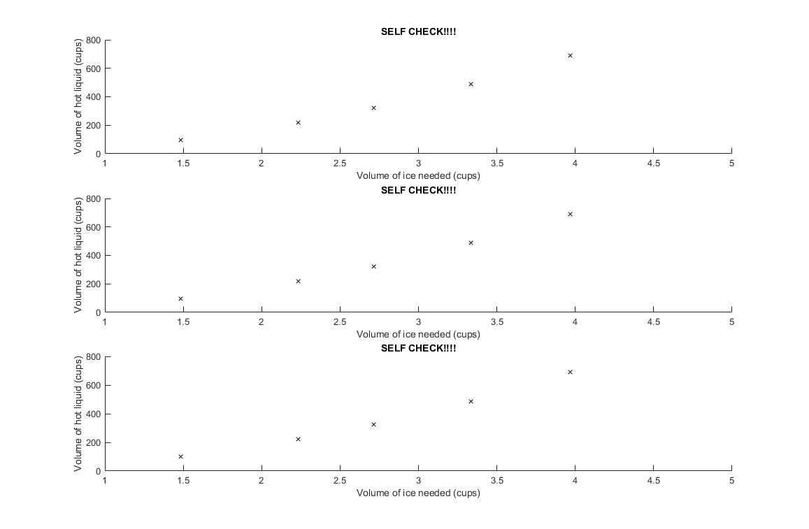
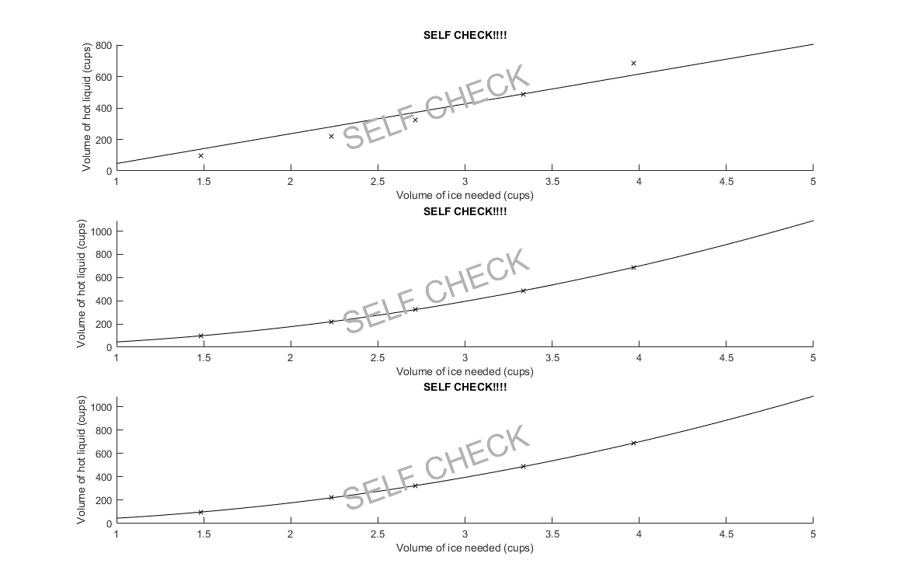

# Homework 6 - Problem 1 Reading data and polynomial

This one is pretty simple. Make sure you know how to use `polyfit` and `polyval`.
Reffer to zybooks/google if you don't know. 

**[READ THIS BEFORE YOU BEGIN!!!!!!](https://github.com/RyoTakei/Matlab-Class)**
-

## Breakdown

This problem is all about reading data from a file, and make a polynomial function
to plot line of best fit. 

<details><summary>!! Nerds only !!</summary>
<p>
So if you know Taylor's series, you might already know that any function can be 
"approximated" by a polynomial, within some range. Now that's really interesting
is that we can do the same thing, but rather than approximating a function, we 
can use polynomial to connect ALL points in the graph. Kind of crazy to think about 
but it's actaully true. If you have 2 points, you can connect them with a line. 
If you have 3 points, you can connect them with 2nd degree polynomial, etc etc. 
So simply put, if you have 30 points in the graph, there is a 29th degree polynomial 
that connects all 30 points. 

To see this in action, feel free to download 
"LeastSquareFit.m" or copy and paste following code in your matlab. You can 
change `points` variable and see that it actaully works.

```matlab
% Written by Ryo at 3 am haha
% Change points variable!!!!!


clear;
clc;
clf;

%%%%%%%%%%%%%%%%%%%%%%%%%%%
% CHANGE THIS!!!!!!!
% Don't touch anything else lol
%
% I just added random values here.
% You can add as many as you want. Add 30 points if you want.
%
% Make sure to match the format. 
% format of "x, y;" for all of them!!!!
points = [
    2, 4;
    3, 8;
    4, 10;
    8, 27;
    9, 32;
    12, 87;
    43, 20;
];
%
% Don't touch anything else!
% If you break this code, let me know too. 
%%%%%%%%%%%%%%%%%%%%%%%%%%%%%%%%%%

% Just getting x and y from the points
x = points(:, 1);
y = points(:, 2);

% we will plot them
plot(x, y, "*")
hold on;

% Setting up A Matrix
for i = 1:length(x)
    degree = length(x);
    A(:, i) = x.^(degree - i);
end

% B is simply y
B = y;

% Plot the function
t = min(x)-5:0.1:max(x)+5;
plot(t, f(A, B, t))


function y = f(A, B, x)
    % ew math
    coeffs = pinv(A) * B;
    degree = length(B);
    y = 0;
    fprintf("%0.0f degree polynomial Function:\n y = ", degree);
    for i = degree-1:-1:0
        y = y + coeffs(degree - i) .* x.^(i);
        fprintf("%0.6f*x^%0.0f + ", coeffs(degree - i), i);
    end
    fprintf("0\n")
end
```

What I'm doing here is not any high school level math. Or I don't think 
you'd learn this in undergrad either lol.

Look up Moore–Penrose inverse if you're feeling like it. I just happened to 
know because I had to do this before. And is very cool. Anyhow....
</p>
</details>

We are given x and y values from the file. Now, make sure you know where the data files
are on your computer. I recommend keeping them in the same folder as your scripts. 

So we have two things to do.

1. We need to get those data from the files we're given
2. Plot them
3. We find 1st, 2nd, and 3rd degree polynomial.
4. Use your method of choosing to get values at x=1.5.

Make sure you know how `polyfit` and `polyval` work!!! I won't teach ya ;))

### Step Reading data from the file
Let's go ahead and grab our data from the files. We are given those files and we need 
to read them and load them into a variable. Matlab made this easier for us, so it's just 
a single function -- `dlmread`. This part is as simple as

```matlab
data = dlmread("your/file/location")
```

Again, it's VERY IMPORTANT that you know where your data files are located at. If your file 
is located in the same folder as your script, it should be easy. But if they are in downloads 
folder, well, you have some work to do. Make sure to do this correctly otherwise, it will
not work.

Now, we need to know which one is going to be our x values and which one is going to be your y values.
Go take a look at the instruction and see which one makes more sense. After that, go ahead and 
call `dlmread` and assign data from files into variables. You can call them x, y, or whatever. 

Make sure to check workspace window, and those values are actually stored into variables as arrays.

### Step 2. Plot them

Before we do anything with polynomial, let's plot them so that we know what we're looking for.
THe easiest, and cleanest way to do this is to use for loop. 

```matlab
for k = 1:3
    subplot(3, 1, k);
    plot( .... );
    % Make sure to add title, labels and legend.
end
```

We've done this many times. You should be able to plot our points into 3 graphs. 
At this point, all your graphs should look the same. Since we haven't done anything 
with polynomials, all your graphs look exactly the same


<details><summary><b>!! Self Check Here !!</b></summary>
<p>



</p>
</details>


### Step 3. Finding polynomial coefficients 
This part is pretty simple. Since you already know `x` and `y`, you can simply use `polyfit` to
calculate the coefficients. Make sure to repeat 3 times for 1st, 2nd, and 3rd degree 
arguments to find 3 of them. 

This is where you can take different paths. 

PATH 1) you can do this in the for loop from step 1. You simply calculate k-th degree polynomial
(remember, k is running from 1 to 3 so perfect actually). And once you have coefficients, 
you can graph it while you're in the for loop. To do this, since you're already given the range,
`range = 1:increments:5` where you define your own `increments`, that will be your x values. So what's 
y? Well, you can easily calculate y by calling `polyval` over the `range`. In fact, you can 
just throw in the entire range, and it will spit out all the y values corrispond to range. After that, 
just use `plot` to plot range vs results of polyval.

PATH 2) You take this completely outside of for the for loop. You already know the equation for 
1st, 2nd, and 3rd degree polynomial, you can make anonymous function for each using coefficients
from `polyfit` and plot that using `fplot`.

Whatever is easiest for you, both will work just fine.


<details><summary><b>!! Self Check Here !!</b></summary>
<p>



</p>
</details>


### Step 4. Finding y at x = 1.5
This one is easy. Use `polyval` and you're done....


But wait, what's our coefficient? Which polynomial are we using? Good question. I wish I could say 
"whatever you want", but you do need to justify "why" you chose that polynomial over the other ones.
Here's what the instruction says:
```text
Hint: how much ice is needed to chill 0 cups of hot liquid?
```
So what's the answer? How many cups of ice should it take to chill 0 cups of hot liquid? 
And which polynomial gives you the closest to your answer? 

(You will need to use `polyval` here to evaluate y at x = 0. And compare y for all of them,
and see which one is closest to your answer. There should be a clear winner out of three)

Once you pick the polynomial, then, it's simply just using `polyval`.


## That's all! 
Take a look at "Nerds only" section(right below Breakdown). I think you will find it 
pretty interesting how this works. If you just want to survive and pass this class, feel free to skip.
